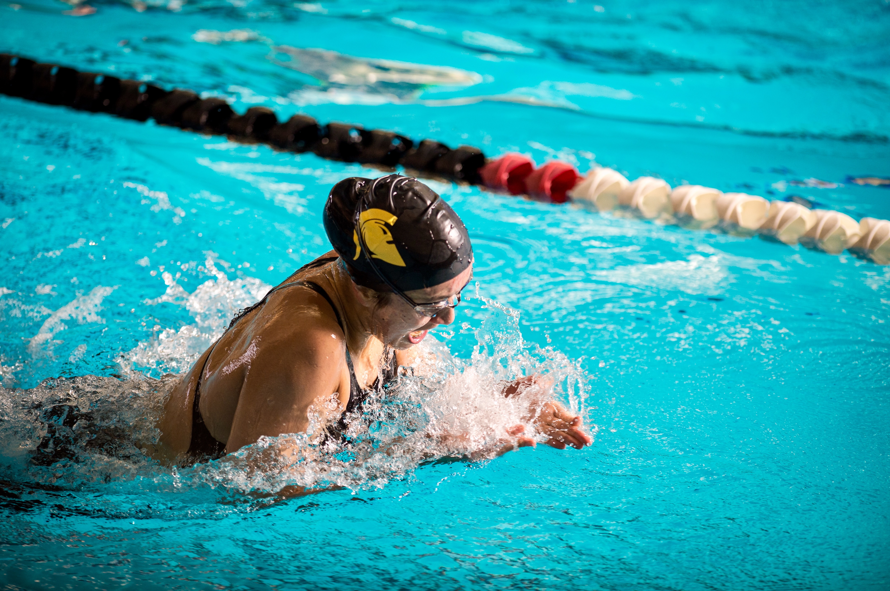
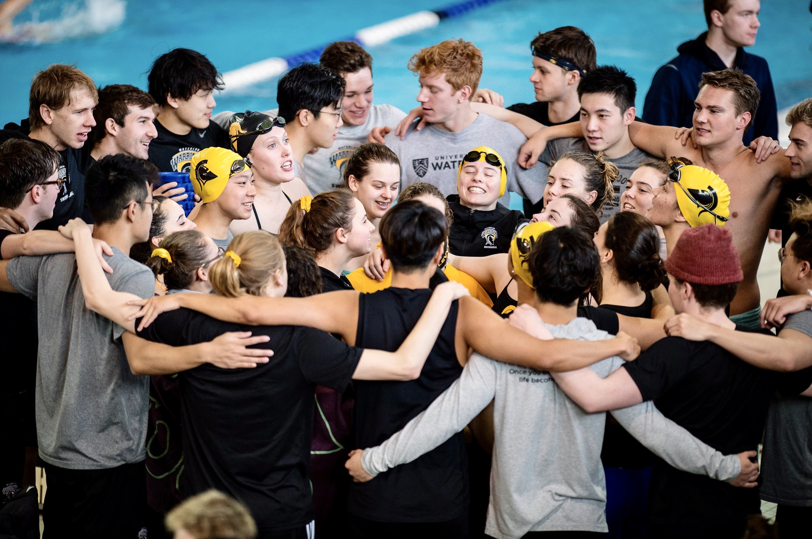

 

## Music

I play the piano regularly, with a preference for pieces that sound nice but aren't too hard to play --- many things by [Ludovico Einaudi](https://ludovicoeinaudi.com/complete-works/) fit this description, and I've recently learned "The Breach" and "Dans les bois" from [Alexandra Stréliski's](https://alexandrastreliski.com/?lang=en) <em>Néo-Romance</em> (see below).
More generally, I am a very amateur enthusiast of classical music.

::: {.column-page-inset-center}
::: {layout="[50,50]"}

::: {.column}
<iframe data-testid="embed-iframe" style="border-radius:12px" src="https://open.spotify.com/embed/artist/2uFUBdaVGtyMqckSeCl0Qj?utm_source=generator&theme=0" width="100%" height="352" frameBorder="0" allowfullscreen="" allow="autoplay; clipboard-write; encrypted-media; fullscreen; picture-in-picture" loading="lazy"></iframe>
:::

::: {.column}
<iframe data-testid="embed-iframe" style="border-radius:12px" src="https://open.spotify.com/embed/album/7zyVDBlmL1u4ltO7O46c4o?utm_source=generator&theme=0" width="100%" height="352" frameBorder="0" allowfullscreen="" allow="autoplay; clipboard-write; encrypted-media; fullscreen; picture-in-picture" loading="lazy"></iframe>
:::

:::
:::

## Swimming (and other sports)

I swam competitively from the age of eight through the fourth year of my undergraduate degree, a span of about 13 years.
I had a lot of fun experiences and learned a great deal about time management and hard work, but these days I am very much a "swammer."
Instead I enjoy participating in intramurals (flag football and volleyball so far) and watching tennis.

::: {.column-page-inset-center}
::: {layout="[50,50]"}

:::
:::

## I am not a web developer (anymore)

During my undergraduate degree I worked briefly as a web developer, but
the site you are on right now was adapted (with permission) from the source code of [Prof. Daniel J. McDonald](https://dajmcdon.github.io/)'s personal website.

